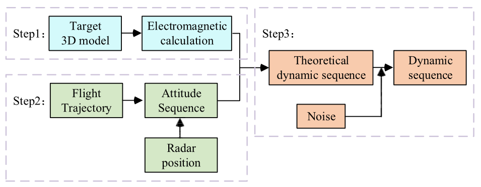

# IMD: ISAR dataset for micro-motion targets.

> **Warning**❗:  This repository is still under construction, as the corresponding paper is still under submission. The uploaded code is not yet complete, and we are still performing final validation and testing. 
>
> TODO: 
>
> - fix plot ticks.
> - experiment example guide.

## Introduction

The IMD dataset is a radar dataset generated through simulation. It features a scenario where a fully-polarized ISAR radar is used to track and image space micro-motion targets for classification. Consequently, it includes wideband and narrowband radar echoes under full polarization, with an observation time of 2 seconds.

The purpose of creating this dataset is straightforward: existing research does not make their datasets publicly available, and it is challenging to obtain these datasets by contacting the authors of the relevant papers. Of course, it is possible to perform simulations independently, but the details of the simulations can lead to significant differences in the data, making meaningful comparisons impossible. Moreover, electromagnetic simulations are highly time-consuming, and we don't want any researchers to waste their time on these tasks.

This dataset (and the additional versions it includes) can be applied to a variety of tasks. Here, I will only list some of the prior research; for detailed examples, please refer to these papers.

- Create new models for radar target recognition. Related work includes:[[1]](https://ieeexplore.ieee.org/document/10124243/), [[2]](https://ieeexplore.ieee.org/document/9691916/), [[3]](https://ieeexplore.ieee.org/document/10281917/), [[4]](https://ieeexplore.ieee.org/document/10431715/). 
- Generate data using a small amount of existing data to improve classification accuracy (since such observational data is difficult to obtain in real-world scenarios). Related work includes: [[5]](https://www.mdpi.com/2072-4292/15/21/5085).

- Micro-motion parameter estimation. Related work includes: [[6]](https://www.mdpi.com/2072-4292/14/15/3691).

Of course, these research directions are just broad summaries. Various detailed studies, such as exploring effective feature fusion methods, investigating polarization data fusion for recognition, extracting micro-motion curves, and experimenting with different radar signal processing techniques, can all make use of this dataset.

## Overall workflow

The most commonly used method for dataset construction in existing papers is similar to the process shown in the following figure, which is clipped from [[4\]](https://ieeexplore.ieee.org/document/10431715/). Generally, the process is divided into three main steps: static electromagnetic calculations, generating dynamic aspect angle sequences (also referred to as attitude sequences), and producing echoes using interpolation functions. In these experiments, the sampling interval for static electromagnetic calculations is typically set to 0.1 (though 0.2 is also used in some cases). The target's motion trajectory varies, including static, linear motion, and ballistic motion. The interpolation functions used are often not clearly described in the papers. These inconsistencies undoubtedly increase the difficulty of reproducing the experiments, not to mention that electromagnetic simulations are already extremely time-consuming tasks.

In this project, we directly provide [fully polarized electromagnetic simulation data](https://figshare.com/articles/dataset/Static_electric_field_data_of_four_types_of_targets_/27247074?file=49844442) based on the physical optics (PO) method, as well as [a dataset of aspect angle sequences](https://figshare.com/articles/dataset/Aspect_angle_sequences_of_ballistic_conical_targets_/27266262) for targets undergoing two-body ballistic motion. 

## Kinematic model

To simplify the question, we only use reference coordinates to describe the earth, the orbit of target, the reference coordinates of radar, and the target body axis, which means we lack the geoscience description, but they are sufficient to describe the procession of a ballistic micro-motion conical target movement.

Firstly, the orbit of target is only decided by the release velocity $v$ and position $r$, which means we can use them to calculate orbit elements: 

- $a$
- $e$
- $i$
- $\Omega$
- $\omega$
- $f$

With those elements and the position of release, the flight procession can be plot as follow.

<table>
    <tr>
        <td style="text-align: center;">
            
             
            <i>viewing angle: elev=0,azim=90.</i>
        </td>
        <td style="text-align: center;">
            
             
            <i>viewing angle: elev=-65,azim=63.</i>
        </td>
    </tr>
</table>

By restricting the ground radar observation positions and the observed trajectories, corresponding scenarios for the training and testing datasets can be constructed.

<table>
    <tr>
        <td style="text-align: center;">
            
             
            <i>Training Dataset.</i>
        </td>
        <td style="text-align: center;">
            
             
            <i>Testing Dataset.</i>
        </td>
    </tr>
</table>

Now, let's consider the attitude of the target. Taking the conical target in the figure below as an example, we assume that the re-entry direction of the target is fixed (as designed), with its head pointing towards the ground, which means the warhead should be oriented below the y-axis (with the orbit in the $YOZ$ plane). Due to spin stabilization, the precession axis will remain fixed in inertial space.

<table>
    <tr>
        <td style="text-align: center;">
            
             
            <i>Origin</i>
        </td>
        <td style="text-align: center;">
            
             
            <i>Rotated</i>
        </td>
    </tr>
</table>

Adding micro-motion to the existing attitude results in the final model.

<table>
    <tr>
        <td style="text-align: center;">
            
             
            <i>Coning</i>
        </td>
        <td style="text-align: center;">
            
             
            <i>Coning</i>
        </td>
        <td style="text-align: center;">
            
             
            <i>Nutation</i>
        </td>
    </tr>
</table>

## Electromagnetic simulation

The simulation method is based on the physical optics (PO) approach. A total of four types of targets are used for classification, and their structures are referenced in [[1]](Recognition of Micro-Motion Space Targets Based on Attention-Augmented Cross-Modal Feature Fusion Recognition Network), [[2]](https://ieeexplore.ieee.org/document/9691916/). Similar structures have also been used in many other studies.

## Automatic Dataset Generation

he `DownloadDataset.ipynb` notebook, located in the `Generation` folder, provides a streamlined process to automatically download and generate the radar dataset from Figshare. This script generates **fully-polarized radar data (HH, HV, VH, VV)** with an observation duration of **0.5 seconds** for each instance by default.

You can also generate the **full 2-second dataset** by modifying the indexing of the radar line-of-sight (LOS) angle sequence in the script.

> **Note:** Generating the dataset with 0.5s observation requires at least **170 GB** of free disk space. Please ensure sufficient storage is available before proceeding.

All classification experiments in the `Example` folder are based on the **0.5-second radar dataset**. To run these scripts, you must first **generate the dataset locally** using the provided tools.

**Note:** The updated visualization script will be released in an upcoming update.
